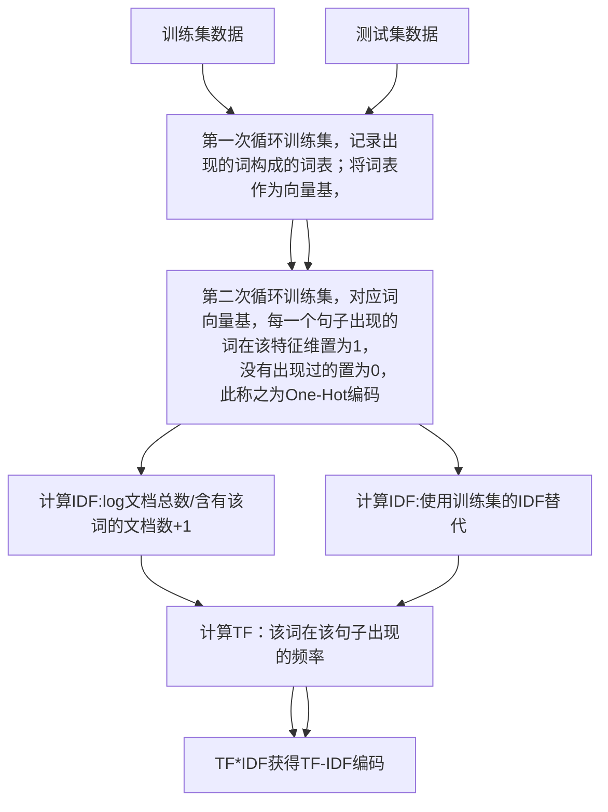
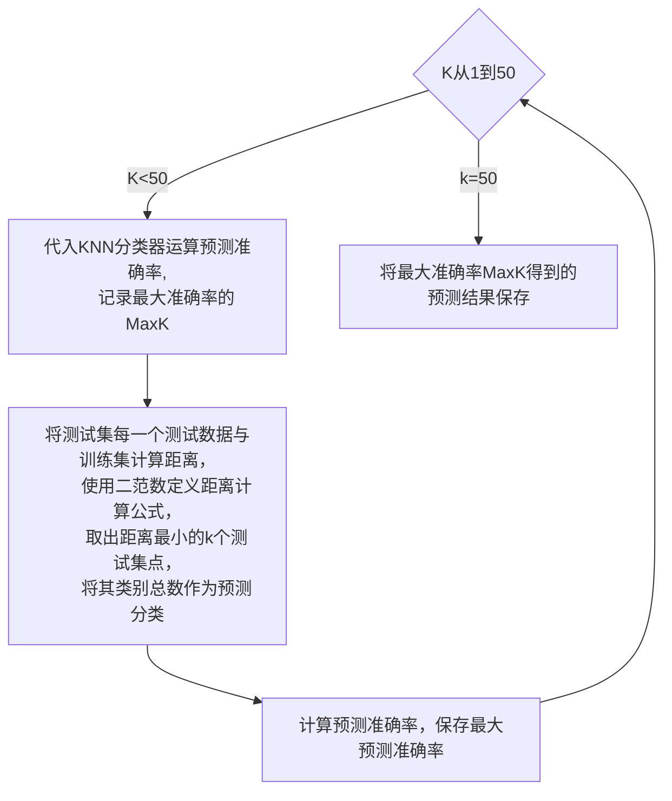

# **中山大学计算机学院** **本科生实验报告**（2023学年春季学期）

## 课程名称：Artificial Intelligence **人工智能**

| 教学班级        |      | 专业（方向） |      |
| --------------- | ---- | ------------ | ---- |
| 学号  2233 6173 |      | 姓名  罗弘杰 |      |

## 实验题目 KNN与朴素贝叶斯多分类器


## 实验内容

算法原理

KNN算法原理：

1. **基本思想**：KNN算法的核心思想是通过**找到与新数据点最相似的K个训练数据点**来进行分类。它基于特征空间中的邻近性，即假设相似的数据点具有相似的标签。
2. **距离度量**：KNN算法使用距离度量来确定数据点之间的相似度。常用的距离度量包括欧氏距离、曼哈顿距离、闵可夫斯基距离等。
3. **分类过程**：
4. - 对于给定的新数据点，计算它与训练集中每个数据点的距离。
   - 根据距离找到与新数据点最近的K个训练数据点。
   - 根据这K个邻居的标签，采用多数投票的方式确定新数据点的类别。
5. **K值选择**：K值是算法的一个关键参数，它决定了模型的复杂度和预测的准确性。通常通过交叉验证等方法来选择最优的K值。

朴素贝叶斯分类算法原理：

1. **贝叶斯定理**：朴素贝叶斯算法基于贝叶斯定理，即根据条件概率来估计给定一个类别的情况下，另一个事件发生的概率。贝叶斯定理表达如下：

2. 𝑃(𝐴∣𝐵)=𝑃(𝐵∣𝐴)⋅𝑃(𝐴)𝑃(𝐵)*P*(*A*∣*B*)=*P*(*B*)*P*(*B*∣*A*)⋅*P*(*A*)

3. 其中，𝑃(𝐴∣𝐵)*P*(*A*∣*B*) 是在给定B的情况下A的概率，𝑃(𝐵∣𝐴)*P*(*B*∣*A*) 是在给定A的情况下B的概率，𝑃(𝐴)*P*(*A*) 和 𝑃(𝐵)*P*(*B*) 分别是A和B的边缘概率。

4. **特征条件独立假设**：朴素贝叶斯算法假设给定类别的情况下，特征之间是相互独立的。这意味着特征之间的存在不会影响彼此的出现概率。尽管这个假设在现实中并不总是成立，但它简化了计算，使得朴素贝叶斯算法易于实现且高效。

5. **模型训练**：

6. - 计算每个类别的先验概率 𝑃(𝐶𝑘)*P*(*C**k*)，即在不考虑任何特征的情况下，一个样本属于类别 𝐶𝑘*C**k* 的概率。
   - 对于每个特征 𝑥𝑖*x**i*，计算在给定类别 𝐶𝑘*C**k* 下的条件概率 𝑃(𝑥𝑖∣𝐶𝑘)*P*(*x**i*∣*C**k*)，即特征 𝑥𝑖*x**i* 出现在属于类别 𝐶𝑘*C**k* 的样本中的概率。

7. **模型预测**：

   ​	对于一个新样本，计算其属于每个类别的后验概率。

   ​	根据后验概率选择具有最高概率的类别作为预测结果。

伪代码：

```
#TF-IDF
1. 对文档集合 D 进行预处理：
   - 分词
   - 去除停用词
   - 转换为小写

2. 计算每个词的TF-IDF值：
   2.1 计算词频TF（Term Frequency）：
       - 对于每个文档 d ∈ D：
           - 统计词频 TF(w, d) = (单词 w 在文档 d 中出现的次数) / (文档 d 的总词数)
   2.2 计算逆文档频率IDF（Inverse Document Frequency）：
       - 对于每个单词 w：
           - 统计包含该单词的文档数量 DF(w)
           - 计算逆文档频率 IDF(w) = log((总文档数) / (DF(w) + 1)) + 1
   2.3 计算TF-IDF值：
       - 对于每个文档 d ∈ D，每个单词 w：
           - TF-IDF(w, d) = TF(w, d) * IDF(w)

3. 构建TF-IDF编码矩阵：
   - 对于每个文档 d ∈ D：
       - 将 TF-IDF(w, d) 添加到 TF-IDF 编码矩阵的相应位置
   - 返回 TF-IDF 编码矩阵
```


```
#KNN 
function KNN_predict(new_sample, dataset, labels, k):
    distances = [] # 用于存储新样本与每个训练样本的距离
    for i in range(len(dataset)):
        # 计算新样本与每个训练样本的距离
        distance = calculate_distance(new_sample, dataset[i])
        distances.append((distance, labels[i])) # 将距离和标签组成元组存入列表

    # 对距离进行排序
    distances.sort(key=lambda x: x[0])
    
    # 统计最近的k个样本中各类别的出现次数
    class_votes = {}
    for i in range(k):
        label = distances[i][1]
        class_votes[label] = class_votes.get(label, 0) + 1
    
    # 选择出现次数最多的类别作为预测结果
    predicted_label = max(class_votes, key=class_votes.get)
    return predicted_label
```

流程图：

数据预编码：本实验使用了两种编码方法：One-Hot和TF-IDF，在实验结果会呈现两种的效果。







关键代码展示（带注释）

```python
'''
	训练集的编码方法，需要存储IDF给测试集使用
'''
#使用TF-IDF加权编码
#计算IDF
IDF = np.zeros(len(df.columns)-2) #初始化IDF
for word in df.columns[2:]:
    sum = 0 #计算出现单词的文档数
    condition = df[word] == 1 #出现过的条件
    sum = sum + len(df[condition]) #计算出现单词的文档数
    IDF[df.columns.get_loc(word)-2] = math.log(len(df)/sum+1) #计算IDF
#保存IDF
df_IDF = pd.DataFrame(IDF, index=df.columns[2:], columns=["IDF"])
df_IDF.to_csv("IDF.csv")

#计算TF
for i in range(len(df)):
    words = df.iloc[i]["emotion_words"].split()
    for word in words:
        df.at[df.index[i], word] = counter(words, word)/len(words) #计算频率
        df.at[df.index[i], word] = df.at[df.index[i], word]*IDF[df.columns.get_loc(word)-2]         #计算TF-IDF
df.to_csv("train_tfidf.csv") #保存TF-IDF编码的数据
```


```python
'''
	KNN分类器，使用二维距离来作为度量，计算K个最近的点，取分类总数作为类别预测
'''
#KNN分类器
class K_classifier:
    def __init__(self, k, train_data, train_label):
        self.k = k
        '''
        train_data shape : (n_samples, n_features)
        '''
        self.train_data = train_data
        '''
        train_label shape : (n_samples, 1)
        '''
        self.train_label = train_label

    def __call__(self, x):
        '''
            this function is to predict the label of x
        '''
        distances = []
        for i in range(self.train_data.shape[0]):
            distance = Minkowski_distance(x, self.train_data[i], 2)  #2维距离
            distances.append((distance, self.train_label[i], i))
        distances.sort(key=lambda x:x[0]) #按照距离排序,从小到大
        labels = [item[1] for item in distances[:self.k]] #取前k个的label
        index = [item[2] for item in distances[:self.k]]
        return max(set(labels), key=labels.count) #返回出现次数最多的label
```

```python
'''
	主函数中的调用方法，由于需要训练超参数K,所以需要遍历K可能的范围，以获得分类效果最好的k
'''

Max_k = 0
Max_accuracy = 0
import matplotlib.pyplot as plt
x = []
y = []
for k in range(1, 50):
    K_classifier = K_classify.K_classifier(k, train_data, train_label) #创建K_classifier对象
    predict_label = []
    for i in range(len(test_data)):
        predict_label.append(K_classifier(test_data[i]))

    df_predict_label = pd.DataFrame(predict_label, columns=["emotionId"])

    #计算准确率
    #先获得正确的标签
    correct_label = pd.read_csv("test_label.csv") #读取正确的标签
    #计算准确率
    correct_label = correct_label["emotionId"].values
    count = 0
    for i in range(len(correct_label)):
        if correct_label[i] == predict_label[i]:
            count += 1
    accuracy = count / len(correct_label)
    if accuracy > Max_accuracy:
        Max_accuracy = accuracy
        Max_k = k
    x.append(k)
    y.append(accuracy)

```

创新点&优化（如果有）

1. 通过训练获得最佳超参数。
2. 通过两种编码格式来比较效果。

## 实验结果及分析

1\. 实验结果展示示例（可图可表可文字，尽量可视化）

​	输出为test.output.csv:


2\. 评测指标展示及分析（机器学习实验必须有此项，其它可分析运行时间等）

使用TF-IDF的分类效果：最好的K是15，分类准确率达到了36.8%


使用One-Hot编码实验得到的结果：最好的K是21，分类准确率达到38.1%


## 参考资料

PS：可以自己设计报告模板，但是内容必须包括上述的几个部分，不需要写实验感想
